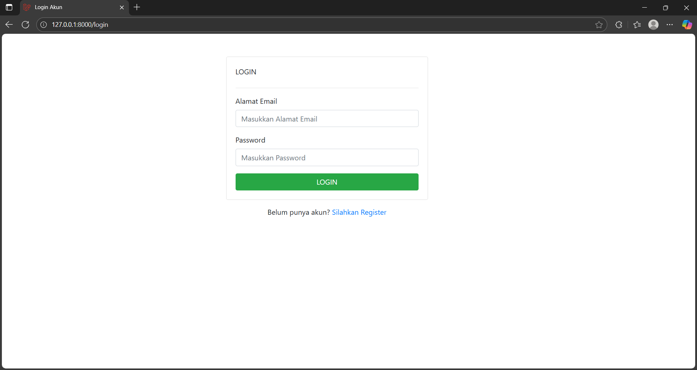
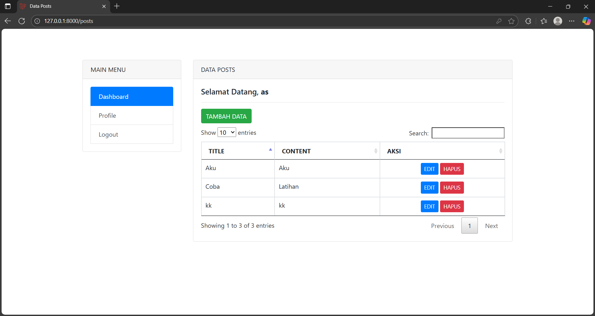

# 🚀 CRUD Sederhana Laravel - Aplikasi Manajemen Postingan

Selamat datang di proyek latihan CRUD (Create, Read, Update, Delete) sederhana yang dibangun menggunakan Laravel. Proyek ini merupakan aplikasi web dasar untuk manajemen postingan blog, lengkap dengan sistem otentikasi pengguna.

Proyek ini dibuat sebagai bagian dari proses belajar fundamental Laravel, mencakup konsep-konsep inti seperti Routing, Controller, Model, View (Blade), Eloquent, Middleware, dan Validasi.

---

## ✨ Fitur Utama

-   **Otentikasi Pengguna:**
    -   Registrasi Akun Baru
    -   Login Pengguna
-   **Manajemen Postingan (CRUD):**
    -   Menampilkan semua postingan dalam tabel yang interaktif.
    -   Menambah postingan baru melalui form.
    -   Mengedit postingan yang sudah ada.
    -   Menghapus postingan.
-   **Rute Terlindungi:** Halaman manajemen postingan hanya bisa diakses oleh pengguna yang sudah login.
-   **Rich Text Editor:** Menggunakan CKEditor untuk input konten agar mendukung formatting teks.
-   **Tabel Interaktif:** Menggunakan DataTables untuk fitur pencarian, sorting, dan paginasi pada tabel postingan.
-   **Notifikasi & Validasi:**
    -   Pesan notifikasi sukses setelah berhasil menambah, mengedit, atau menghapus data.
    -   Pesan error validasi yang jelas jika input form tidak sesuai aturan.

---

## 🛠️ Teknologi yang Digunakan

-   **Backend:** PHP, Laravel Framework
-   **Frontend:** HTML, Bootstrap 4, JavaScript
-   **Database:** MySQL
-   **Library JavaScript:**
    -   jQuery
    -   DataTables (untuk tabel)
    -   SweetAlert2 (untuk notifikasi AJAX di form login/register)
    -   CKEditor 4 (untuk text editor)

---

## 📋 Panduan Instalasi & Penggunaan

Berikut adalah langkah-langkah untuk menjalankan proyek ini di lingkungan lokal Anda.

### Prasyarat

-   PHP (versi 8.1+)
-   Composer
-   Node.js & NPM
-   Web Server Lokal (XAMPP, Laragon, dll.)
-   Database (MySQL/MariaDB)

### Langkah-langkah

1.  **Clone Repository**
    ```bash
    git clone [URL_REPOSITORY_ANDA]
    cd [NAMA_FOLDER_PROYEK]
    ```

2.  **Install Dependensi**
    Pasang semua dependensi PHP yang dibutuhkan dengan Composer.
    ```bash
    composer install
    ```

3.  **Buat File Environment**
    Salin file `.env.example` menjadi `.env`.
    ```bash
    copy .env.example .env
    ```
    *Jika Anda menggunakan Linux/Mac, gunakan `cp .env.example .env`*

4.  **Generate Application Key**
    Buat kunci enkripsi unik untuk aplikasi Anda.
    ```bash
    php artisan key:generate
    ```

5.  **Konfigurasi Database**
    -   Buat sebuah database baru di phpMyAdmin atau tool sejenis (misalnya, beri nama `db_latihan_crud`).
    -   Buka file `.env` dan sesuaikan pengaturan database Anda:
        ```env
        DB_CONNECTION=mysql
        DB_HOST=127.0.0.1
        DB_PORT=3306
        DB_DATABASE=db_latihan_crud
        DB_USERNAME=root
        DB_PASSWORD=
        ```

6.  **Jalankan Migrasi**
    Buat semua tabel yang dibutuhkan di database Anda.
    ```bash
    php artisan migrate
    ```

7.  **Jalankan Server Lokal**
    ```bash
    php artisan serve
    ```

8.  **Selesai!**
    Buka browser Anda dan akses `http://127.0.0.1:8000`. Anda bisa mulai dengan membuat akun baru melalui halaman registrasi.

---

### Screenshot (Contoh)

Anda bisa menambahkan screenshot aplikasi Anda di sini untuk membuat README lebih menarik.

*Screenshot Halaman Login*


*Screenshot Dashboard Postingan*

